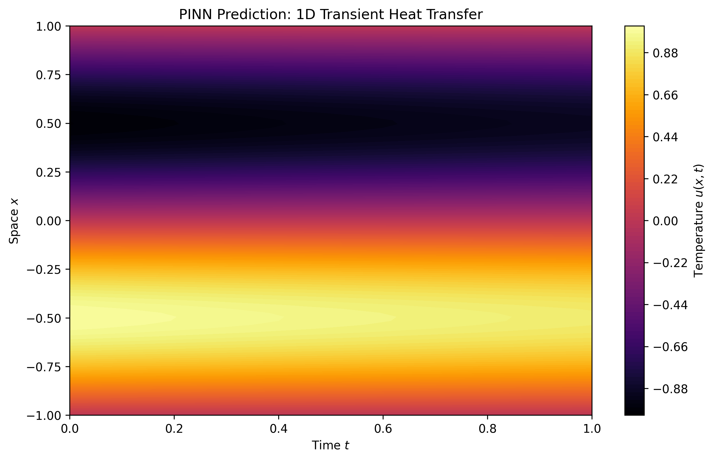

# Physics-Informed Neural Networks (PINN) for 1D Heat Equation 🔥

This repository contains a PyTorch implementation of a Physics-Informed Neural Network (PINN) to solve the 1D transient heat transfer equation. The model predicts the spatio-temporal temperature distribution by embedding thermodynamic laws directly into the neural network's loss function.

## 📌 Problem Formulation
We solve the 1D Transient Heat Equation:

$$ \frac{\partial u}{\partial t} = \alpha \frac{\partial^2 u}{\partial x^2} $$

- **Spatial Domain:** $x \in [-1, 1]$
- **Temporal Domain:** $t \in [0, 1]$
- **Thermal Diffusivity ($\alpha$):** $0.01$
- **Initial Condition (IC):** $u(x,0) = -\sin(\pi x)$
- **Boundary Conditions (BC):** $u(-1,t) = 0$ and $u(1,t) = 0$ (Ends are kept at zero temperature).

## 🚀 Features
- **Dynamic PDE Sampling:** Collocation points are resampled at every epoch using Latin Hypercube Sampling (LHS) to prevent spatial overfitting.
- **Hybrid Optimization:** Uses **Adam** for initial convergence and **L-BFGS** for high-precision fine-tuning.
- **Modular Architecture:** Clean, production-ready codebase separated into modules.

## 🛠️ Installation & Usage

1. Clone the repository:
git clone https://github.com/IL_TUO_NOME_UTENTE/PINN-Heat-Equation.git
cd PINN-Heat-Equation

2. Install dependencies:
pip install -r requirements.txt

3. Run the training:
python main.py

## 📊 Results
The network successfully predicts the temperature decay over time.

